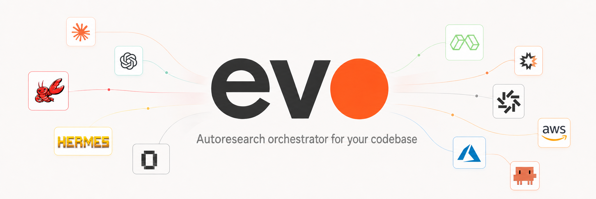
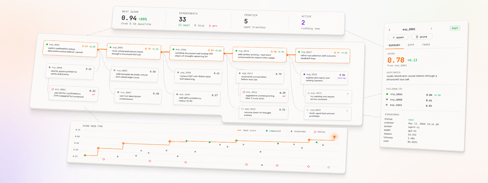

<p align="center">
  
</p>

# evo

Autoresearch orchestrator for your codebase.
*Inspired by [Karpathy's autoresearch](https://github.com/karpathy/nanochat).*

Runs on Claude Code, Codex, OpenClaw, Hermes, or Opencode. Experiments
run locally or on remote sandboxes — Modal, E2B, Daytona, AWS, Azure, SSH.

Point it at a repo. evo explores the code, instruments a benchmark, and
runs an optimization loop — spawning subagents **in parallel**, each in
its own isolated workspace, forming a hypothesis and editing toward it.
The orchestrator collects results, decides which branch to extend next
via a **configurable frontier strategy** (argmax, top-K, ε-greedy,
softmax, or GEPA-inspired Pareto-per-task), keeps what improves the
score, discards what doesn't. Runs until you stop it.

## What it looks like

<p align="center">
  
</p>

## Workflow

Two skills, used in sequence:

- **discover** — one-time setup. Explores the codebase, picks an
  optimization target, builds a benchmark, runs the first experiment.
- **optimize** — the search loop. Parallel subagents form hypotheses,
  edit, get scored. Runs until you stop it or `stall` rounds produce no
  improvement.

`optimize` parameters:

| Parameter | Default | Description |
|-----------|---------|-------------|
| `subagents` | 5 | Parallel subagents per round |
| `budget` | 5 | Max iterations each subagent can run within its branch |
| `stall` | 5 | Consecutive rounds with no improvement before auto-stopping |

## Quickstart

**1. Install the CLI.**

```bash
uv tool install evo-hq-cli              # or: pipx install evo-hq-cli
evo --version
```

For remote backends, install with the matching provider extra:

```bash
uv tool install 'evo-hq-cli[modal]'
# available: [modal], [e2b], [daytona], [aws], [azure], [all]
```

**2. Add the plugin to your host.**

Install the host's own CLI first (`claude`, `codex`, `openclaw` via
npm; `hermes` and `opencode` per their docs), then:

```bash
evo install <host>     # claude-code | codex | hermes | opencode | openclaw
```

Verify any install: `evo doctor <host>`.

`evo install <host>` drives the host's marketplace install AND fetches
the platform-native hot-path binary (`evo-hook-drain`) for mid-run
inject. If you installed the plugin manually (e.g. `claude plugin
install evo@evo-hq-evo` directly), still run `evo install claude-code`
afterwards to stage the binary — without it, `evo direct` directives
won't be delivered to running agents.

Host-specific caveats:

- **Codex** uses a hook trust model. evo's hooks (used to send
  mid-round instructions to running subagents — e.g. "all your
  hypotheses are converging on the same dead end — try angle X") install
  untrusted by default. Run `/hooks` inside codex to trust them, or pass
  `--trust-hooks` to `evo install codex` for non-interactive setups.
- **Opencode**'s `task` tool is batch-parallel (subagents in a round
  return together when the slowest finishes). Optimize loop works fine;
  reactive workflows that act on early completions don't.

**3. Run `discover`, then `optimize`.**

| Host | discover | optimize |
|---|---|---|
| Claude Code | `/evo:discover` | `/evo:optimize` |
| Codex | `$evo discover` | `$evo optimize` |
| Others | use your host's skill-mention syntax | |

Pass `optimize` parameters as `key=value` after the skill name:

```
/evo:optimize                                    # all defaults
/evo:optimize subagents=3 budget=10 stall=3      # narrower fanout, deeper branches
$evo optimize subagents=10                       # Codex: wider fanout
```

## Upgrading

```bash
evo update <host>                    # host: claude-code | codex | hermes | opencode | openclaw
evo update <host> --version 0.4.1    # pin to a release
```

See `evo update --help` for `--force` (cache-wipe reinstall), `--scope`,
and other options.

### Migrating from v0.4.0 or earlier

```bash
uv tool install --force evo-hq-cli && evo update --force
```

`--force` wipes the host plugin cache and reinstalls. Works around an
upstream cache-invalidation bug in Claude Code
([anthropics/claude-code#14061](https://github.com/anthropics/claude-code/issues/14061))
that leaves stale files even when `/plugin update` reports success.

### Testing a pre-release (alpha)

`uv` and `pip` skip pre-releases by default, so the migration command
above always lands on the latest stable. To test an alpha, pin both the
CLI install and the host plugin update:

```bash
uv tool install --force 'evo-hq-cli==0.4.1a2' && \
  evo update --version 0.4.1-alpha.2 --force
```

Replace `0.4.1a2` / `0.4.1-alpha.2` with whichever alpha you want. The
two version forms differ because PyPI normalises `0.4.1-alpha.2` to
`0.4.1a2`, while the plugin marketplace tag is `v0.4.1-alpha.2`.

## How it works

### Parallel

The orchestrator fans subagents out simultaneously. Each runs in its own
isolated workspace, picks up shared state (failure traces, annotations,
discarded hypotheses), forms its own hypothesis, edits, and runs the
benchmark. If a subagent has iteration budget left and sees a follow-up,
it iterates on its branch within the same round.

### Frontier strategy

After each round, the orchestrator picks which committed branch to
extend next. Pluggable:

- **argmax** — always extend the best score
- **top_k** — round-robin among the K best
- **epsilon_greedy** — best most of the time, random sometimes
- **softmax** — sample weighted by score
- **pareto_per_task** — keep specialists the aggregate hides, inspired
  by [GEPA](https://arxiv.org/abs/2507.19457)

Set in the dashboard's Frontier tab — strategy descriptions and params
are shown inline.

### Cross-cutting scans

Between rounds, [RLM](https://arxiv.org/abs/2512.24601)-inspired scan
subagents read trace batches in parallel and surface compound failure
patterns — gate-failure intersections, semantic root causes — that the
next round's hypotheses can target directly.

### Gating

Regression tests or safety checks wire up as a gate. An experiment that
doesn't pass gets discarded, even if its score improves.

## Where experiments run

| Backend | Where | Install |
|---|---|---|
| **worktree** *(default)* | local git worktree per experiment | included |
| **pool** | reuse a fixed set of local workspaces | included |
| **ssh** | your own SSH host | included |
| **modal** | Modal serverless cloud | `uv tool install 'evo-hq-cli[modal]'` |
| **e2b** | E2B cloud sandboxes | `uv tool install 'evo-hq-cli[e2b]'` |
| **daytona** | Daytona cloud workspaces | `uv tool install 'evo-hq-cli[daytona]'` |
| **aws** | AWS EC2 sandboxes | `uv tool install 'evo-hq-cli[aws]'` |
| **azure** | Azure VMs | `uv tool install 'evo-hq-cli[azure]'` |

Pick and configure in the dashboard's Backend tab.

## Dashboard

Starts automatically with `evo:discover` (or `evo init`). The agent
surfaces the URL in chat:

```
Dashboard live: http://127.0.0.1:8080 (pid 12345)
```

If `8080` is busy, evo auto-increments (`8081`, `8082`, …) and prints
the actual port. Start it manually with:

```bash
uv run --project /path/to/evo/plugins/evo evo dashboard --port 8080
```

The chosen port is persisted to `.evo/dashboard.port` so repeat runs
re-use it.

## Dev install

For working on evo itself (not just using it):

```bash
git clone https://github.com/evo-hq/evo
cd evo
uv run --project plugins/evo evo --version
```

`uv run` resolves dependencies on first use — no `pip install` step.

The SDKs live in separate packages:

- `sdk/python/` — `evo-hq-agent`, Python 3.10+, zero deps. Tests: `cd sdk/python && uv run --with pytest pytest test/`.
- `sdk/node/` — `@evo-hq/evo-agent`, Node 18+, zero deps. Tests: `cd sdk/node && npm test`.

## License

Licensed under the [Apache License 2.0](LICENSE).
